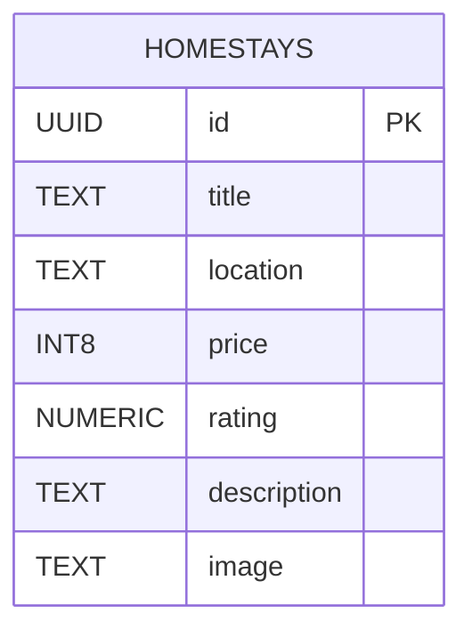

# Stayora 🏡

Stayora is a full-stack homestay booking platform developed as part of my internship project. It allows users to explore homestays, while the backend provides REST APIs connected to a real PostgreSQL database hosted on Supabase.

---

## 🚀 Features

- Browse homestays
- Search homestays by location
- Create new homestays
- Update homestay details
- Delete homestays
- RESTful API architecture
- PostgreSQL database integration using Supabase

---

## 🛠️ Tech Stack

### Frontend
- Next.js
- React
- Tailwind CSS

### Backend
- Node.js
- Express.js

### Database
- PostgreSQL (Supabase)

---

## 📂 Project Structure

```
stayora/
│
├── app/
├── public/
├── backend/
│   ├── config/
│   ├── controllers/
│   ├── routes/
│   ├── data/
│   ├── .env.example
│   └── server.js
│
└── README.md
```

---

## 🗄️ Database

This project uses **PostgreSQL** hosted on **Supabase**.

### Why PostgreSQL + Supabase?

- Cloud-hosted database
- Reliable and scalable
- Easy integration with Express.js
- Supports SQL queries and relationships
- Free tier suitable for development

---

## 📊 Database Schema

| Column | Type |
|---------|------|
| id | UUID (Primary Key) |
| title | TEXT |
| location | TEXT |
| price | INT8 |
| rating | NUMERIC |
| description | TEXT |
| image | TEXT |

---

## ⚙️ Environment Variables

Create a `.env` file inside the backend folder.

```env
PORT=5000

SUPABASE_URL=your_supabase_project_url

SUPABASE_SERVICE_ROLE_KEY=your_service_role_key
```

---

## 📦 Installation

Clone the repository

```bash
git clone <repository-url>
```

Go to backend

```bash
cd backend
```

Install dependencies

```bash
npm install
```

Run backend

```bash
npm start
```

Run frontend

```bash
npm run dev
```

---

## 📡 API Endpoints

| Method | Endpoint |
|---------|----------|
| GET | /api/homestays |
| GET | /api/homestays/:id |
| GET | /api/homestays/search?location=Goa |
| POST | /api/homestays |
| PUT | /api/homestays/:id |
| DELETE | /api/homestays/:id |


## 📊 Database Schema



---

## 👩‍💻 Author

**Suhani Garg**

Stayora – Full Stack Homestay Booking Platform

Built using:
- Next.js
- Express.js
- PostgreSQL (Supabase)
- Tailwind CSS